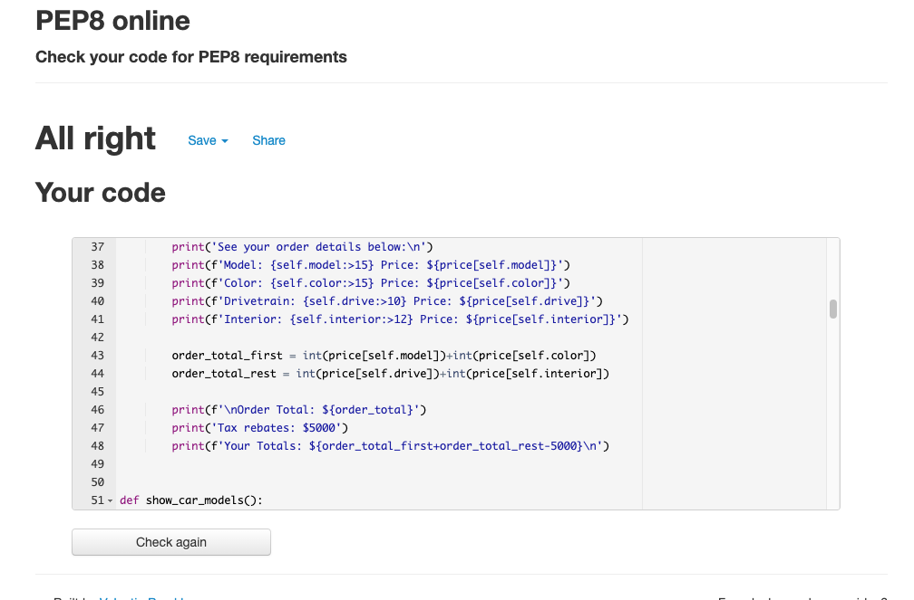

<h1 align="center">Tesla Order App</h1>
<h2 align="center"></h2>
This web app is for users who are interested in buying a car and are specifically looking to buy a Tesla. The app provides options for the user to choose from all the different models of the Tesla brand and further provides additional options such as color, engine choice, interior options and then displaying the total cost for the user depending on their preferences.           

[View the live project here.](https://teslaorderapp.herokuapp.com/)

## User Experience (UX)

-   ### User stories

    -   #### First Time Visitor Goals
        As a first time visitor I expect to easily be able to make my selections depending on the options I am shown.  
        As a first time visitor I want to be able to see the neccesary information to be able to make a descicion.  
        As a first time visitor I expect information about pricing, packages, model features etc.

    -   #### Returning Visitor Goals
        As a returning user I want to be able to navigate through the different options available and make another order.

    -   #### Frequent User Goals
        It is unlikely users will become frequent buyers for an expensive product that very few can afford to buy.

-   ### Design
    The structure and design of the system is developed with ease of use in mind. To create user value, only the information necessary at a particular moment is shown to the user at the right time. Each step in the ordering process is carefully thought out with improved user experience in mind.

-   ### Flowchart
    -Overview of the design flow process that describes each step in the process that the application executes.

## Features

- ### The welcome screen
    -   Welcomes the customer to the ordering system and displays the options available for different models.

- ### The color screen  
    -   In the color screen, the user is able to choose between the different options that is  
    available for that particular model.

- ### The drivetrain screen  
    -   The drivetrain screen displays the options for either 2WD or 4WD to the user.

- ### The interior screen  
    -   In the interior page once can choose to upgrade your car from standard black to white interior.

- ### The summary screen  
    -   In the summary screen, an overview of all the choices the customer has made, the price  
    for each item is display and the total price with deducted tax rebates are calculated  
    and shown to the user.
    

- ### The endmessage screen  
    -   At the end of the ordering process, the user can decide whether to continue with another  
    order or quit the app, in which case the system greets the customer good bye.

## Technologies Used

### Languages Used
 - [Python](https://en.wikipedia.org/wiki/Python_(programming_language)) 
    - The main language used  
  

### Frameworks, Libraries & Programs Used
  - [Git](https://git-scm.com/)
    - Git was used for version control through the Gitpod terminal to commit and push to GitHub
 - [GitHub:](https://github.com/)
     - Was used for all storing and backup of the code pertaining to the project. 
 - [Heroku:](https://heroku.com/)
     - Was used to deploy the project. 
 - [Time:](https://docs.python.org/3/library/time.html)   
    - Module in Python integrated in the application.
 - [Pyfiglet:](https://pypi.org/project/pyfiglet/0.7/) 
    - Module used in the application to create the logo effect.
## Testing

### Testing User Stories from User Experience (UX) Section

-   #### First Time Visitor Goals
    - As a first time visitor I expect to easily be able to make my selections depending on the options I am shown.  
        - The different options is design to be easy to navigate and to quickly understand what is expected by the user from the application.  

    - As a first time visitor I want to be able to see the neccesary information to be able to make a descicion.
        - Information is provided as needed, such as no unnecessary information is provided n order ease the decision making process for the user.  

    - As a first time visitor I expect information about pricing, packages, model features etc.  
        - During the steps that the user proceeds through in the ordering process, all the necessary information is provided where the user makes their choices. 

-   #### Returning Visitor Goals
    - As a returning user I want to be able to navigate through the different options available and make another order.  
        - The application is planned so that users easily learn the process and can make a second order quickly at a low learning curve.

-   #### Frequent User Goals  
    - It is unlikely users will become frequent buyers for an expensive product that very few can afford to buy.

### Further Testing  
- I have tested the application thoroughly in order to find any discrepancies and to confirm that everything is working as it intended to do. Extensive testing was performed in order to make sure the validation function works correctly and the order summary calculates the pricing correctly. 
- [PEP8](http://pep8online.com/)
    - Code validation was confirmed by using the PEP8 website.

### Known Bugs
|Bug | Solution | Status |
|----|:---------|:-------|
|Validation of the user input did not work properly | Implement a try/except statement | Fixed |

## Deployment

### Forking the GitHub Repository
1. Go to [the project repository](https://github.com/ErikHgm/Tesla-Order-App)
2. In the right most top menu, click the "Fork" button.
3. There will now be a copy of the repository in your own GitHub account.

### Running the project locally
1. Go to [the project repository](https://github.com/ErikHgm/Tesla-Order-App)
2. Click on the "Code" button.
3. Choose one of the three options (HTTPS, SSH or GitHub CLI) and then click copy.
4. Open the terminal in you IDE program. 
5. Type `git clone` and paste the URL that was copied in step 3.
6. Press Enter and the local clone will be created. 

### Alternatively by using Gitpod:
1. Go to [the project repository](https://github.com/ErikHgm/Tesla-Order-App)
2. Click the green button that says "Gitpod" and the project will now open up in Gitpod.

### Creating an Application with Heroku

I followed the below steps using the Code Institute tutorial:

The following command in the Gitpod CLI will create the relevant files needed for Heroku to install your project dependencies `pip3 freeze --local > requirements.txt`. Please note this file should be added to a .gitignore file to prevent the file from being committed.

1. Go to [Heroku.com](https://dashboard.heroku.com/apps) and log in; if you do not already have an account then you will need to create one.
2. Click the `New` dropdown and select `Create New App`.
3. Enter a name for your new project, all Heroku apps need to have a unique name, you will be prompted if you need to change it.
4. Select the region you are working in.

#### Heroku Settings  
You will need to set your Environment Variables - this is a key step to ensuring your application is deployed properly.
1. In the Settings tab, click on `Reveal Config Vars` and set the following variables:
    - If using credentials you will need to add the credentials as a variable, the key is the name 'CREDS' and the value is the contents of your creds JSON
    - Add key: `PORT` & value `8000`
2. Buildpacks are also required for proper deployment, simply click `Add buildpack` and search for the ones that you require.
    - For this project, I needed to add `Python` and `Node.js`, in this order.

####  Heroku Deployment  
In the Deploy tab:
1. Connect your Heroku account to your Github Repository following these steps:
    - Click on the `Deploy` tab and choose `Github-Connect to Github`.
    - Enter the GitHub repository name and click on `Search`.
    - Choose the correct repository for your application and click on `Connect`.
2. You can then choose to deploy the project manually or automatically, automatic deployment will generate a new application every time you push a change to Github, whereas manual deployment requires you to push the `Deploy Branch` button whenever you want a change made.
3. Once you have chosen your deployment method and have clicked `Deploy Branch` your application will be built and you should now see the `View` button, click this to open your application.

## Credits
    

### Code
- The inspiration on how to use the while loop when validating user input data comes from the Code Institutes Love Sandwich project.
- [W3Scools](https://www.w3schools.com/) for ideas and inspiration.

### Acknowledgements
I would like to thank:

- The tutor support team att Code Institute for their support.
- My Code Institute Mentor for feedback and suggestions.